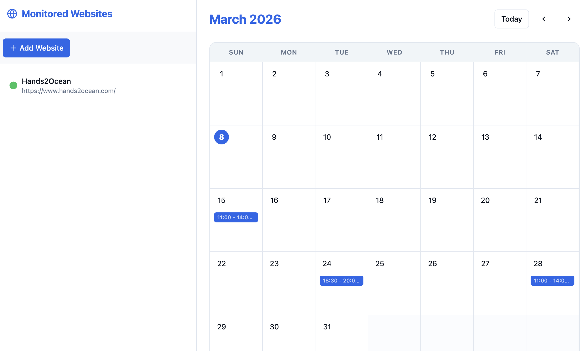

# Calendar Aggregator

[](https://fastapi.tiangolo.com/)
[](https://www.python.org/)
[](https://react.dev/)
[](https://vitejs.dev/)
[](https://www.typescriptlang.org/)
[](LICENSE)

Web-based system that monitors event websites, extracts events via LLM, and exposes them through a REST API with a calendar UI.

## Project structure

```
calendar-aggregator/
├── backend/           # Python FastAPI API & extraction pipeline
├── frontend/          # React + Vite UI
├── tests/             # Backend tests
├── requirements.txt
└── package.json       # Root scripts (dev:all, dev:backend, dev)
```

## Run

```bash
# Install root deps (concurrently)
npm install

# Install frontend deps
npm run install:frontend

# Run backend (Python, port 8000) + frontend (Vite, port 8080) together
npm run dev:all
```

Or separately:
```bash
# Backend only
python -m backend.main

# Frontend only (in another terminal)
npm run dev
```

Backend: http://localhost:8000 | Docs: http://localhost:8000/docs  
Frontend: http://localhost:8080

## Backend setup

```bash
python -m venv venv
source venv/bin/activate   # or venv\Scripts\activate on Windows
pip install -r requirements.txt
```

Copy `.env.example` to `.env` and set `OLLAMA_MODEL=llama3.2` (or another model). Run `ollama pull llama3.2`.

## How to use



1. **Add websites** – Click **+ Add Website** in the left sidebar and enter a URL (e.g. an events page). The app will test connectivity before adding it.

2. **Extract events** – After adding a website, click the refresh icon next to it to scrape and extract events using the LLM. Events are stored and shown on the calendar.

3. **View the calendar** – The main panel shows a monthly calendar. Events appear as blue bars with time slots. Use **Today** and the arrow buttons to move between months.

4. **Event details** – Click an event on the calendar to open a modal with full details (time, location, description, source link).

---

# Lovable project info

**URL**: https://lovable.dev/projects/REPLACE_WITH_PROJECT_ID

## How can I edit this code?

There are several ways of editing your application.

**Use Lovable**

Simply visit the [Lovable Project](https://lovable.dev/projects/REPLACE_WITH_PROJECT_ID) and start prompting.

Changes made via Lovable will be committed automatically to this repo.

**Use your preferred IDE**

If you want to work locally using your own IDE, you can clone this repo and push changes. Pushed changes will also be reflected in Lovable.

The only requirement is having Node.js & npm installed - [install with nvm](https://github.com/nvm-sh/nvm#installing-and-updating)

Follow these steps:

```sh
# Step 1: Clone the repository using the project's Git URL.
git clone <YOUR_GIT_URL>

# Step 2: Navigate to the project directory.
cd <YOUR_PROJECT_NAME>

# Step 3: Install the necessary dependencies.
npm i

# Step 4: Start the development server with auto-reloading and an instant preview.
npm run dev
```

**Edit a file directly in GitHub**

- Navigate to the desired file(s).
- Click the "Edit" button (pencil icon) at the top right of the file view.
- Make your changes and commit the changes.

**Use GitHub Codespaces**

- Navigate to the main page of your repository.
- Click on the "Code" button (green button) near the top right.
- Select the "Codespaces" tab.
- Click on "New codespace" to launch a new Codespace environment.
- Edit files directly within the Codespace and commit and push your changes once you're done.

## What technologies are used for this project?

This project is built with:

- Vite
- TypeScript
- React
- shadcn-ui
- Tailwind CSS

## How can I deploy this project?

Simply open [Lovable](https://lovable.dev/projects/REPLACE_WITH_PROJECT_ID) and click on Share -> Publish.

## Can I connect a custom domain to my Lovable project?

Yes, you can!

To connect a domain, navigate to Project > Settings > Domains and click Connect Domain.

Read more here: [Setting up a custom domain](https://docs.lovable.dev/features/custom-domain#custom-domain)
