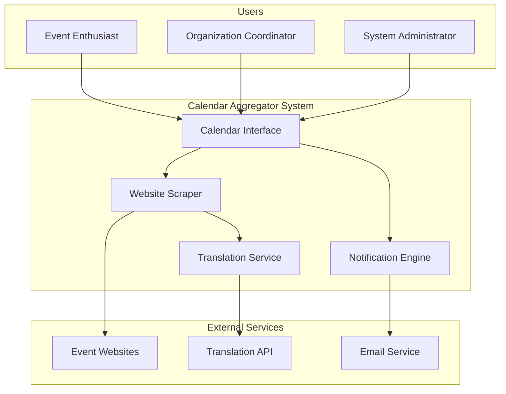
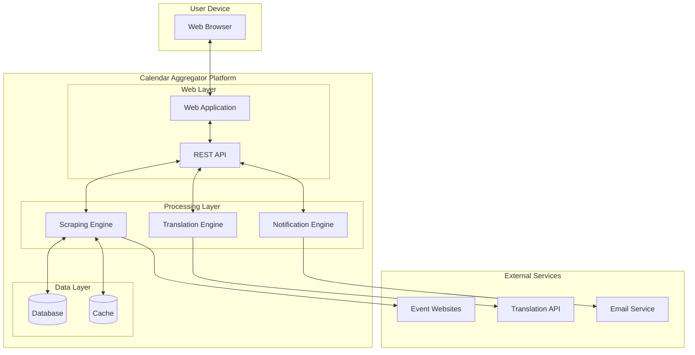
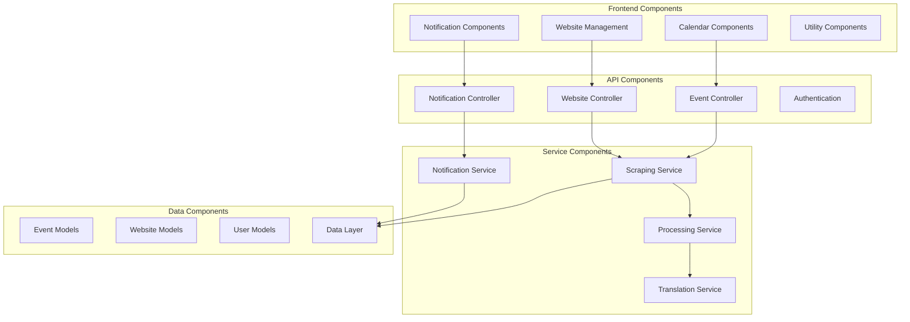
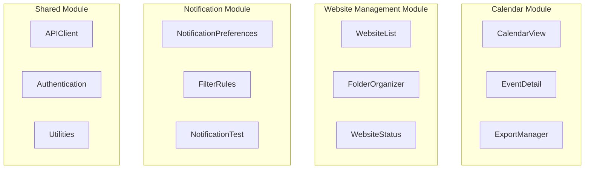
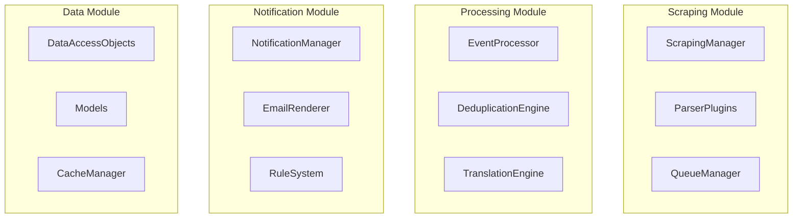

# Design and Architecture Document
## Calendar Aggregator System

**Group Members:**  
[Team Member Names]  
[Student IDs]  

**Teaching Assistant:**  
[TA Name]

---

## Table of Contents

1. [Introduction](#1-introduction)
2. [Architecture](#2-architecture)
   - 2.1 [Conceptual View](#21-conceptual-view)
   - 2.2 [Container Diagram](#22-container-diagram)
   - 2.3 [Components View](#23-components-view)
   - 2.4 [Module View](#24-module-view)
   - 2.5 [Class Diagrams](#25-class-diagrams)
   - 2.6 [Execution View](#26-execution-view)
3. [Technology Stack](#3-technology-stack)
4. [Glossary](#4-glossary)

---

## 1. Introduction

This project involves the development of a web-based Calendar Aggregator system that monitors multiple event websites, automatically extracts event information, and presents this data in a unified calendar interface. The system serves users who need to track events across disparate sources, providing features such as automatic translation, notification management, and calendar export functionality.

The project addresses two primary use cases: individual event enthusiasts who want to discover and track events from multiple sources, and organization coordinators who need to monitor industry events and competitor activities. The system automatically handles the complexity of parsing different website formats, translating content, and managing notification preferences.

The development follows a service-oriented architecture with clear separation between the web scraping engine, data processing components, user interface, and notification services. The system is designed for scalability and maintainability, allowing for easy addition of new website parsers and notification channels.

### 1.1 Stakeholders

Stakeholders have varying architectural concerns that shape the system design:

#### 1.1.1 End Users - Event Enthusiasts and Coordinators
Users prioritize system reliability, performance, and ease of use. The architecture must ensure consistent event discovery, accurate data extraction, and responsive user interfaces. The system should handle failures gracefully and provide clear feedback about website monitoring status.

#### 1.1.2 System Administrators
Administrators require monitoring capabilities, maintainable code structure, and deployment flexibility. The architecture should provide comprehensive logging, health monitoring, and modular components that can be updated independently.

#### 1.1.3 Content Providers - Website Owners
While not direct users, website owners' content structures and access policies influence the scraping architecture. The system must respect robots.txt files, implement appropriate request throttling, and adapt to website structure changes.

---

## 2. Architecture

### 2.1 Conceptual View



#### 2.1.1 Event Enthusiast and Organization Coordinator
- **Requirements**: US1, US2, US3, US4, US5, US6, US7, US9, US10
- **Description**: Primary users who interact with the system to discover, organize, and track events from multiple sources
- **Goals**: Monitor relevant events, receive timely notifications, and export calendar data for external use
- **Input**: Website URLs, folder organization preferences, notification settings
- **Output**: Organized calendar view, email notifications, .ics export files
- **Design**: Users interact primarily through the web interface, with the system handling complex backend operations transparently

#### 2.1.2 Website Scraper
- **Requirements**: WM-ADD, WM-VIS, EE-PARSE, EE-TRANS, EE-DEDUP
- **Description**: Core service responsible for monitoring websites, extracting event information, and processing content
- **Goals**: Reliable event extraction with high accuracy and minimal resource usage
- **Input**: Website URLs, parsing configurations, update schedules
- **Output**: Structured event data, website status information, error logs
- **Design**: Modular scraping engine with pluggable parsers for different website types, built-in retry mechanisms and error handling

#### 2.1.3 Calendar Interface System
- **Requirements**: CI-VIEW, CI-DETAIL, CI-EXPORT, NS-CONFIG
- **Description**: Web application providing user interface for event viewing, management, and system configuration
- **Goals**: Responsive, intuitive interface supporting all user workflows
- **Input**: User interactions, event data from scrapers
- **Output**: Calendar views, configuration interfaces, export files
- **Design**: Single-page application with component-based architecture, real-time updates, and responsive design

### 2.2 Container Diagram



#### 2.2.1 Web Application
- **Requirements**: CI-VIEW, CI-DETAIL, CI-EXPORT, WM-ADD, WM-ORG
- **Description**: Single-page application providing the user interface for calendar viewing and website management
- **Goals**: Deliver responsive, accessible interface for all user interactions
- **Input**: User interactions, API responses
- **Output**: Rendered calendar views, management interfaces
- **Design**: React-based SPA with modular components, state management, and real-time updates via WebSocket connections

#### 2.2.2 REST API
- **Requirements**: All functional requirements as integration layer
- **Description**: API gateway managing communication between frontend and backend services
- **Goals**: Secure, performant interface for all system operations
- **Input**: HTTP requests from web application
- **Output**: JSON responses with event data, status information
- **Design**: RESTful architecture with authentication, rate limiting, and comprehensive error handling

#### 2.2.3 Scraping Engine
- **Requirements**: EE-PARSE, EE-DEDUP, WM-VIS
- **Description**: Core service for website monitoring and event extraction
- **Goals**: Reliable, scalable event discovery across diverse website formats
- **Input**: Website URLs, parsing configurations
- **Output**: Structured event data, monitoring status
- **Design**: Queue-based processing system with pluggable parsers, retry logic, and comprehensive logging

### 2.3 Components View



#### 2.3.1 Calendar Components
- **Requirements**: CI-VIEW, CI-DETAIL, CI-EXPORT
- **Description**: Frontend components for calendar display and event interaction
- **Goals**: Intuitive calendar interface with comprehensive event details
- **Input**: Event data from API, user interactions
- **Output**: Calendar visualizations, event detail modals, export files
- **Design**: Modular React components with calendar library integration, responsive design patterns

#### 2.3.2 Website Management Components
- **Requirements**: WM-ADD, WM-ORG, WM-VIS
- **Description**: User interface for managing monitored websites and folder organization
- **Goals**: Efficient website management with clear status visibility
- **Input**: User configuration, website status data
- **Output**: Website management interface, folder organization
- **Design**: Drag-and-drop interface with real-time status updates and validation

#### 2.3.3 Scraping Service
- **Requirements**: EE-PARSE, EE-TRANS, EE-DEDUP
- **Description**: Backend service orchestrating website monitoring and data extraction
- **Goals**: Scalable, reliable event discovery with intelligent parsing
- **Input**: Website configurations, parsing rules
- **Output**: Structured event data, processing metrics
- **Design**: Plugin architecture supporting multiple parser types, queue-based processing, error recovery

### 2.4 Module View

#### 2.4.1 Frontend Modules



**Package "Calendar"**
- **Requirements**: CI-VIEW, CI-DETAIL, CI-EXPORT
- **Description**: Components handling calendar display and event interaction
- **Goals**: Comprehensive calendar functionality with export capabilities
- **Design**: Modular components using calendar library, event detail modals, .ics generation

**Package "WebsiteManagement"**  
- **Requirements**: WM-ADD, WM-ORG, WM-VIS
- **Description**: Interface for managing monitored websites and organization
- **Goals**: Intuitive website management with clear status indicators
- **Design**: Hierarchical folder structure, drag-and-drop organization, real-time status updates

#### 2.4.2 Backend Modules



**Package "Scraping"**
- **Requirements**: EE-PARSE, WM-VIS
- **Description**: Core website monitoring and event extraction functionality
- **Goals**: Reliable, scalable event discovery with plugin architecture
- **Design**: Queue-based processing, pluggable parsers, comprehensive error handling

**Package "Processing"**
- **Requirements**: EE-TRANS, EE-DEDUP
- **Description**: Event processing, translation, and deduplication services
- **Goals**: High-quality event data with intelligent duplicate detection
- **Design**: Pipeline architecture with configurable processing steps

### 2.5 Class Diagrams

#### 2.5.1 Core Event Management Classes

```mermaid
classDiagram
    class Event {
        +String id
        +String title
        +DateTime startTime
        +DateTime endTime
        +String location
        +String description
        +String sourceUrl
        +String originalLanguage
        +EventStatus status
        +validateEvent() boolean
        +toICS() String
    }
    
    class Website {
        +String id
        +String url
        +String name
        +WebsiteStatus status
        +Folder parentFolder
        +DateTime lastChecked
        +List~ParsingRule~ parsingRules
        +checkAccessibility() boolean
        +updateStatus(WebsiteStatus status)
    }
    
    class Folder {
        +String id
        +String name
        +Folder parent
        +List~Folder~ subFolders
        +List~Website~ websites
        +addWebsite(Website website)
        +removeWebsite(Website website)
        +createSubFolder(String name) Folder
    }
    
    class User {
        +String id
        +String email
        +NotificationPreferences preferences
        +List~Folder~ folders
        +createFolder(String name) Folder
        +getEvents(DateTime start, DateTime end) List~Event~
    }
    
    Event ||--o{ Website : extracted_from
    Website }o--|| Folder : organized_in
    Folder ||--o{ Folder : contains
    User ||--o{ Folder : owns
```

**Event Class**
- **Requirements**: CI-DETAIL, CI-EXPORT, EE-PARSE
- **Description**: Core entity representing extracted event information
- **Goals**: Complete event data model with validation and export capabilities
- **Design**: Immutable entity with validation methods and standard format conversion

**Website Class**
- **Requirements**: WM-ADD, WM-VIS, EE-PARSE  
- **Description**: Represents monitored website with configuration and status
- **Goals**: Comprehensive website monitoring with health tracking
- **Design**: Active entity with status monitoring and parsing rule management

#### 2.5.2 Notification and Processing Classes

```mermaid
classDiagram
    class NotificationManager {
        +EmailService emailService
        +RuleEngine ruleEngine
        +sendNotification(User user, List~Event~ events)
        +processRules(User user, Event event) boolean
        +scheduleNotifications()
    }
    
    class ScrapingEngine {
        +ParserFactory parserFactory
        +QueueManager queueManager
        +processWebsite(Website website) List~Event~
        +scheduleScrapingJobs()
        +handleParsingErrors(Website website, Exception error)
    }
    
    class EventProcessor {
        +TranslationService translationService
        +DeduplicationEngine deduplicationEngine
        +processEvents(List~Event~ events) List~Event~
        +translateEvent(Event event) Event
        +findDuplicates(List~Event~ events) Map~Event, List~Event~~
    }
    
    class NotificationRule {
        +String id
        +RuleType type
        +Map~String, String~ parameters
        +evaluateRule(Event event) boolean
        +getFilterCriteria() FilterCriteria
    }
    
    NotificationManager --> EmailService
    NotificationManager --> RuleEngine
    ScrapingEngine